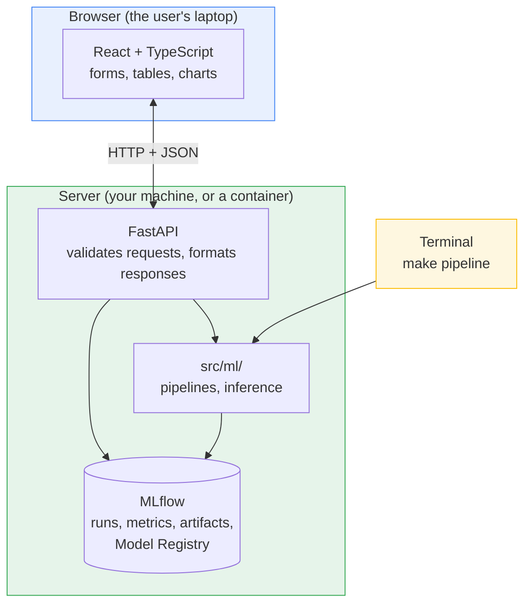
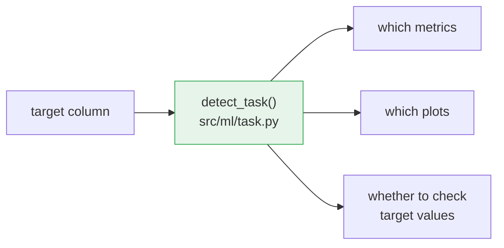

# Architecture: from a terminal pipeline to a web application

## Who this is for

This document is written for a data scientist who is comfortable with Python,
pandas, scikit-learn, and MLflow, but has not built a web application before. It
explains what changes when the same modelling code becomes reachable from a
browser, and introduces the web vocabulary you need in terms of things you
already know.

It describes **one codebase with two front doors**:

- the **terminal**, which is how you have always run this project, and
- the **browser**, which is how a non-technical colleague will use it.

Both doors lead to the same pipelines and the same trained model. Neither
replaces the other.

### Build status

This document describes the target architecture. Not all of it exists yet.

| Layer | Status |
| --- | --- |
| Pipelines (`prepare` → `EDA` → `train`) | Built |
| MLflow tracking, model signature, Model Registry | Built |
| FastAPI layer (`backend/src/api/`) | Built |
| React/TypeScript frontend (`frontend/`) | Built |
| `docker compose` orchestration | Planned — phase 5 |

Until compose exists, the three processes are started separately — see
[Running the system](#10-what-running-the-system-looks-like).

---

## 1. The core shift: a script versus a server

This is the single most important idea in the document. Everything else follows
from it.

**What you have today is a script.** You type a command, it runs top to bottom,
it writes files, and it exits. The Python process lives for a few seconds. If it
hits bad data it raises, prints a traceback, and dies — which is exactly the
behaviour you want, because you are standing right there reading the output.

```text
start ──> read CSV ──> transform ──> train ──> log to MLflow ──> exit
```

**What a web application needs is a server.** A server starts once and then does
nothing. It waits. When a message arrives over the network it runs a small piece
of Python, sends an answer back, and goes back to waiting. It might do that a
thousand times before you stop it.

```text
start ──> load model into memory ──> ┌─> wait ──> answer ──┐
                                     └─────────────────────┘
                                          (forever)
```

That difference has three consequences worth internalising:

**State persists between requests.** Your training run loads a model, uses it,
and throws it away when the process exits. A server loads the model *once at
startup* and keeps it in memory for every subsequent request. Loading an MLflow
model takes a second or two — unacceptable on every request, irrelevant once.

**A crash is no longer a local event.** When your script raises, you see it and
rerun. When a server raises unhandled, it can take down the site for everyone
using it. So a server validates every input before touching it, and converts
every failure into a deliberate, readable response. "Raise loudly and let the
user read the traceback" is correct for a pipeline and wrong for a server.

**Something is always running.** You go from one command that finishes to
several processes that stay up. That is why `docker compose` exists in phase 5 —
to collapse that back into a single command.

---

## 2. What "frontend" and "backend" actually mean

These words get used loosely. Concretely, in this repository:

**Backend** — Python that runs on a server. It can read the filesystem, import
`xgboost`, query MLflow, and load a model. Nobody sees it directly; it only
produces data. This is everything in `backend/`, and it is where all your
existing work lives.

**Frontend** — TypeScript that runs *inside the user's browser*. It draws
buttons, forms, tables, and charts. It cannot read your files, cannot import
Python libraries, and cannot load an MLflow model. It can only ask the backend
for data and display the answer.

That last point is the reason the FastAPI layer has to exist at all. It is a
hard constraint, not a design preference:

> A browser cannot run Python. There is no way for a React page to call your
> model directly. Something must sit in between that speaks both languages —
> Python on one side, and the browser's native protocol on the other.

That in-between thing is the API.

---

## 3. The layers



Read it as three bands:

- **Yellow** is the door you already use. `make pipeline` calls straight into
  `src/ml/` and writes to MLflow. The API is not involved at all.
- **Green** is the backend. `src/ml/` is your existing code, unchanged. FastAPI
  is a thin new layer that wraps it for network access.
- **Blue** is the browser. It only ever talks to FastAPI, never to MLflow or
  your model directly.

Notice that both doors converge on the same `src/ml/` and the same MLflow. There
is no second copy of the modelling logic.

---

## 4. How a prediction actually travels

Here is a concrete trace of one click, end to end. This is the part that makes
the abstraction click for most people.

A colleague opens the page, types feature values into a form, and clicks
**Predict**.

**Step 1 — the browser packages the input.** React collects the form values into
a small text document called JSON. JSON is just a data format, structurally the
same as a Python dict:

```json
{ "MEAN_RADIUS": 17.99, "MEAN_TEXTURE": 10.38, "MEAN_PERIMETER": 122.8 }
```

**Step 2 — the browser sends an HTTP request.** An HTTP request is three things:
a **method** (what kind of action), a **path** (which resource), and optionally a
**body** (the data).

```http
POST /api/predict
Content-Type: application/json

{ "MEAN_RADIUS": 17.99, ... }
```

`POST` means "here is some data, do something with it". `GET` means "give me
something, I'm not changing anything". Those two cover almost everything here.

**Step 3 — FastAPI validates the input.** Before your code runs, FastAPI checks
the JSON against a declared schema. Wrong types, missing fields, or text where a
number belongs are rejected immediately with a clear error. Your Python function
is only called with input already known to be well-formed.

**Step 4 — your Python runs.** The request becomes a one-row pandas DataFrame and
goes to the model that was loaded at startup:

```python
prediction = model.predict(features_df)
```

This is ordinary code of the kind you already write. Nothing web-specific
happens here.

**Step 5 — the answer goes back as JSON**, with a status code saying how it went:

```http
200 OK

{ "prediction": 0, "probability": 0.973, "model_version": "1" }
```

**Step 6 — React displays it.** The page updates without reloading.

The whole round trip is typically tens of milliseconds, because the expensive
part — loading the model — already happened at startup.

---

## 5. Status codes: the server's vocabulary for "how did it go"

Every HTTP response carries a three-digit code. You only need a handful:

| Code | Meaning | When you would see it here |
| --- | --- | --- |
| `200` | OK | A successful prediction or data fetch |
| `422` | Your input was invalid | A missing feature, or text sent where a number belongs |
| `404` | Not found | Asking for an MLflow run ID that does not exist |
| `503` | Service unavailable | **No trained model yet** |
| `500` | The server has a bug | Something genuinely broke in our code |

The `503` case deserves its own note, because it is the first thing that happens
to anyone who clones this template.

On a fresh clone, nobody has trained anything, so there is no registered model to
load. Rather than crashing at startup — which would make the whole application
look broken — the API starts normally, serves everything else, and answers
prediction requests with a readable explanation:

```json
{ "detail": "No registered model found. Run `make pipeline` to train one." }
```

The frontend turns that into a friendly banner telling the user what to do,
instead of a blank screen. This is what "a server must never crash on bad state"
looks like in practice.

---

## 6. Where the model actually lives

This is the part most likely to feel surprising, so it is worth stating directly.

**The API does not train anything, and it does not contain a model.** MLflow is
the handoff point between the two halves of the system.

```text
make pipeline  ──writes──>  MLflow Model Registry  <──reads──  FastAPI
   (training)                 models:/<name>/1                (serving)
```

Training and serving are fully decoupled. They do not run at the same time, do
not share memory, and do not need to run on the same machine. Training publishes
a model; the API looks up whatever the latest published model is and loads it.

Concretely, at startup the API does:

```python
model = mlflow.pyfunc.load_model("models:/ds-template/latest")
```

Two details make this work, both of which were built in phase 2:

**`pyfunc` is flavour-agnostic.** The API has no idea whether you trained
XGBoost, a random forest, or LightGBM. It asks MLflow for "the model" and gets
back something with a `.predict()` method. Swapping estimators in
`cfg/config.yaml` requires no API changes whatsoever.

**The model carries its own signature.** When training logs the model, it also
logs a description of the features it expects — names and types. The API can read
that back:

```python
model.metadata.get_input_schema()
# 30 fields: MEAN_RADIUS (double), MEAN_TEXTURE (double), ...
```

Which brings us to the most important design rule in this architecture.

---

## 7. The rule that keeps this a template

> **Neither the API nor the frontend may hardcode anything about your dataset.**

If `/api/predict` declared 30 named breast-cancer features, and the React form
rendered 30 fixed input boxes, then the day you swap in your own data both would
break — and this would stop being a reusable template.

So the flow is inverted. The frontend *asks* what the fields are:

```text
GET /api/predict/schema
  ↓
{ "features": [ {"name": "MEAN_RADIUS", "type": "double"}, ... ] }
```

...and builds its form from that answer at runtime. The chain of custody is:

```text
your CSV ──> training ──> model signature ──> /api/predict/schema ──> the form
```

Swap your dataset, retrain, reload the page: the form redraws itself with your
columns. No code changes anywhere. The same principle applies to the metrics
dashboard — it renders whatever metric names MLflow reports rather than
hardcoding `accuracy` and `f1_score`.

---

## 7a. One decision drives the whole pipeline: what kind of problem is this?

Before this section's design existed, the template only did binary
classification, and the assumption was scattered: the validation step rejected
anything else, the metrics hardcoded `pos_label`, the plots assumed two classes,
and the schema insisted the target came from a fixed list of values. Supporting
regression meant editing four files and knowing which four.

Now one function answers the question once, and everything follows:



| Task | Metrics | Evaluation plots |
| --- | --- | --- |
| Binary classification | accuracy, precision, recall, f1 | confusion matrix, report, ROC, PR curve |
| Multiclass classification | accuracy, macro precision / recall / f1 | confusion matrix, report |
| Regression | RMSE, MAE, R² | predicted-vs-actual, residuals |

The task is inferred from the target column and logged every run. `task:` in
`cfg/config.yaml` overrides it when the heuristic guesses wrong — integer counts
you want to regress onto look exactly like class labels.

### Why the metrics are a dictionary

`evaluate()` returns `dict[str, float]` rather than a fixed tuple. That one
choice is why the rest works:

- The metric set can differ per task without any caller changing shape.
- MLflow logs whatever is in the dictionary.
- The dashboard renders whatever MLflow reports.

So adding a metric in `compute_metrics` makes it appear in tracking *and* in the
web dashboard with no other edit. It also made the training code shorter — the
old fixed tuple was unpacked into eight named variables and reassembled into a
list before logging.

### What each pipeline step does differently

| Step | Task-dependent? | Why |
| --- | --- | --- |
| `prepare_data.py` | No | Loading and transforming a table is the same work regardless. Its schema check skips target-value validation when `target_values` is null, which is all a continuous target needs. |
| `eda.py` | One plot | The target gets a class-balance bar chart or a histogram. Counting occurrences of a continuous target draws one bar per row. |
| `train_model.py` | Yes | Metrics, evaluation plots, estimator-family check, and whether `stratify` applies. |

Two guards were added because their absence produced errors that pointed at the
wrong thing:

**A mismatched estimator is caught at construction.** A regressor fitted on
class labels trains perfectly happily and only fails later, inside the metrics,
where scikit-learn reports "a mix of binary and continuous targets" — accurate,
but it never mentions that you picked the wrong kind of model. The template now
stops earlier and names the model, the task, and both fixes.

**`stratify` is ignored for regression.** Almost every value in a continuous
target is unique, so scikit-learn refuses with "the least populated class has
only 1 member". The setting is dropped with a log line rather than passed
through.

### Where the template still says no

Two omissions are deliberate rather than unfinished.

**Multiclass gets no ROC or precision-recall curve.** Those are defined for two
classes. Producing one for three would silently give a one-vs-rest curve against
an arbitrary class — a plot that looks entirely reasonable and answers a question
you did not ask. A missing plot is better than a misleading one.

**Categorical features and missing values still stop the pipeline**, with an
error naming the offending columns. Encoding and imputation are modelling
decisions with real consequences, and guessing on your behalf would hide them.

## 7b. The frontend, for someone who has never written one

Four ideas cover most of what the `frontend/` directory is doing.

**HTML is structure, CSS is appearance, JavaScript is behaviour.** A page is a
tree of elements (`<h1>`, `<table>`, `<input>`); CSS rules say how they look;
JavaScript changes them in response to events. TypeScript is JavaScript with
type annotations — the same relationship as adding type hints to Python, with
the same benefit: mistakes surface before the code runs.

**React lets you write the page as functions.** Instead of manually finding an
element and updating it, you write a function that returns what the page *should*
look like given some data, and React works out the minimal changes to the real
page. The syntax that looks like HTML inside TypeScript is called JSX; it
compiles to ordinary function calls.

```tsx
function Metric({ label, value }: { label: string; value: number }) {
  return <div className="metric">{label}: {value.toFixed(4)}</div>;
}
```

That is a *component* — a reusable piece of page, closely analogous to a
function that returns a matplotlib axis.

**Components can hold state, and state changes redraw the page.** `useState`
gives a component a value plus a setter; calling the setter re-runs the function
and React updates the display. This is how typing into the prediction form
updates what will be submitted.

**Data fetching is its own problem, so a library handles it.** Every request has
three possible states — loading, failed, loaded — and forgetting one produces a
blank screen. TanStack Query manages that, plus caching and refetching, so each
page renders three explicit branches:

```tsx
if (runs.isPending) return <Loading />;
if (runs.isError) return <ErrorState error={runs.error} />;
return <RunTable runs={runs.data} />;
```

### What lives where

```text
frontend/src/
├── main.tsx              Startup: mounts React into index.html
├── App.tsx               Routing table — which URL shows which page
├── api/
│   ├── openapi.json      Generated from the backend. Do not hand-edit.
│   ├── schema.d.ts       Generated TypeScript types. Do not hand-edit.
│   ├── client.ts         fetch wrapper; turns failures into typed errors
│   └── hooks.ts          One hook per endpoint (loading/error/caching)
├── lib/
│   └── format.ts         How numbers and dates become text — decided once
├── components/           Reusable pieces (see below)
├── pages/                One per screen: Predict, Runs, RunDetail
└── styles.css            Plain CSS; restyle by editing the variables at the top
```

### The component vocabulary

Pages compose these rather than writing markup, which is what keeps three
separately-written screens feeling like one system:

| Component | Use |
| --- | --- |
| `PageHeader` | Title, a secondary line, optional right-aligned actions |
| `Section` | A titled block with a consistent empty state |
| `DataTable` | Columns described as data, so they can be derived at runtime |
| `KeyValueTable` | Two-column name/value, for parameters and tags |
| `MetricGrid` | Metric tiles, formatted by magnitude |
| `ProbabilityBars` | Per-class scores; absent for regressors |
| `FeatureForm` | Inputs generated from the model signature |
| `Loading` / `EmptyState` / `ErrorState` | The three states every fetch has |

**To add a page:** create it in `pages/`, compose `PageHeader` and `Section`,
fetch with a hook from `api/hooks.ts`, and render the three states. Add a route
in `App.tsx`. No new CSS is normally needed.

### Formatting is a data-type decision, not a styling one

Supporting regression put two very different kinds of number in the same table.
A **bounded score** — accuracy, R², f1 — sits in [0, 1]. An **error term** —
RMSE, MAE — is in whatever units the target uses and might be 54.75 or
128,456.79. One fixed precision cannot serve both:

| Value | `toFixed(4)` | `formatMetric` |
| --- | --- | --- |
| `0.9561` | `0.9561` | `0.9561` |
| `128456.7891` | `128456.7891` | `128,456.79` |
| `0.00003` | **`0.0000`** ← information lost | `3.00e-5` |

`lib/format.ts` chooses from the **magnitude of the value**, never the metric's
name. Matching on names like "accuracy" would tie the UI to one project's
vocabulary; a pipeline logging `test_mape` must display correctly with no
frontend change, which is rule 2 of the previous section applied to numbers.

The same module trims regression predictions. `String(152.13381958007812)`
prints seventeen digits — the model's binary precision, presented as if it were
confidence.

### Theming

`styles.css` is plain CSS with custom properties at the top. Change the values
in `:root` to restyle the entire application; a `prefers-color-scheme` block
below supplies the dark variants. There is no framework, no build step beyond
Vite's, and no component needs editing to rebrand.

```css
:root {
  --accent: #2b6cb0;    /* links, primary buttons, focus rings */
  --surface: #ffffff;   /* cards, tables, form backgrounds */
  --radius: 8px;
}
```

Class names follow a loose `block__element--modifier` convention, so a selector
says where it applies without searching the markup.

## 7c. Keeping the frontend adaptable across ML templates

Four rules do the work. Each exists because breaking it would tie the UI to one
dataset.

**1. Never name a feature in frontend code.** `FeatureForm` receives the list
from `GET /api/predict/schema` and renders one control per entry, choosing the
widget from the declared `kind`. Swap dataset, retrain, reload — the form
changes. Two tests assert this by rendering two entirely different schemas and
checking that the breast-cancer fields are absent from the second.

**2. Derive table columns from the data.** The runs dashboard collects the union
of metric keys across runs rather than hardcoding `accuracy` and `f1_score`. A
regression pipeline logging `test_rmse` shows it immediately — also covered by a
test.

**3. Generate types; never hand-write them.** `schema.d.ts` comes from the
backend's OpenAPI document via `make types`. Rename a Pydantic field and the
frontend fails to compile at the line that needs changing, instead of silently
rendering `undefined`.

**4. Treat "no model yet" as a first-class state, not an error.** A fresh clone
has nothing trained, so the API answers `503`. The UI shows that as guidance
with the command to run — deliberately *not* styled as a failure, because
nothing has failed.

Two supporting habits: keep validation on the server (the form coerces types for
convenience, but the backend's `422` is the authority, so rules live in one
place), and keep styling in CSS variables at the top of `styles.css` so
rebranding does not mean touching components.

## 8. Vocabulary, translated

| Web term | What it means | Closest thing you already know |
| --- | --- | --- |
| **Endpoint** / **route** | One URL the server responds to | A function in a module |
| **HTTP method** | `GET` = read, `POST` = send data | Read versus write |
| **JSON** | Text format for structured data | A `dict`, serialised |
| **Request / response** | The question and the answer | Function arguments and return value |
| **Status code** | Three digits describing the outcome | Exception type versus successful return |
| **Pydantic** | Declares and validates request/response shapes | Pandera, but for JSON instead of DataFrames |
| **OpenAPI schema** | Machine-readable description of the whole API | A type stub file for your service |
| **Port** | Numbered channel a process listens on | Which door of the building |
| **Process** | A running program | One `python` invocation |
| **CORS** | Browser rule about which sites may call the API | An allow-list |
| **SPA** | Single-page app: JS redraws instead of reloading | A notebook that updates a cell's output in place |
| **Component** | A function returning a piece of page | A function returning a plot axis |
| **Props** | Arguments passed into a component | Function arguments |
| **State** | Data a component owns; changing it redraws | A mutable local variable that triggers a re-plot |
| **Hook** | A `use…` function adding behaviour to a component | A decorator or context manager |
| **JSX** | HTML-looking syntax inside TypeScript | An f-string that builds structure, not text |
| **Vite** | Dev server and bundler | `uv` plus a hot-reloading runner |

### Pydantic and Pandera are the same idea

You already validate DataFrames declaratively:

```python
# Pandera — validates a DataFrame
DataFrameSchema({"MEAN_RADIUS": Column(float, Check.ge(0))})
```

Pydantic does the same for HTTP payloads, and FastAPI enforces it automatically:

```python
# Pydantic — validates a JSON request/response
class PredictionResponse(BaseModel):
    prediction: int
    probability: float
```

You will not write validation code by hand in either case. Declare the shape,
get enforcement and error messages for free.

---

## 9. One free thing worth knowing about

FastAPI reads your function signatures and Pydantic models and automatically
generates an interactive documentation page at `/docs`. It lists every endpoint
and gives you a form to call each one live, from your browser.

This matters more than it sounds. It means you can verify the entire backend —
make a real prediction, inspect the response — **before any frontend code
exists**. When something misbehaves later, `/docs` tells you immediately whether
the problem is in Python or in React, which is most of the work of debugging a
web application.

---

## 10. What running the system looks like

### Terminal only (unchanged)

One process, starts and finishes. This is your existing workflow and it is not
going away.

| What | Why |
| --- | --- |
| MLflow server | Receives runs, metrics, artifacts, models |
| `make pipeline` | Runs, writes, exits |

### Full application

Three processes, all staying up, one terminal each. `docker compose` (phase 5)
will start them together.

| Terminal | Command | Port | Role |
| --- | --- | --- | --- |
| 1 | `make mlflow` | 5000 | Stores runs and serves the Model Registry |
| 2 | `make api` | 8000 | Loads the model, answers requests |
| 3 | `make web` | 5173 | Serves the React page to your browser |

Open **`http://localhost:5173`**. The page then calls `/api/...` on its own
origin, and the Vite dev server forwards those to port 8000. That proxy is why
frontend code uses relative URLs and has no backend address compiled into it —
the same code works unchanged when one server serves both in production.

Two local gotchas worth knowing before they cost you an hour:

- **Use `localhost`, not `127.0.0.1`, for the dev server.** Vite binds the
  hostname `localhost`, which on many systems resolves to IPv6 `::1`, so
  `http://127.0.0.1:5173` can refuse the connection while `localhost` works.
- **On macOS, port 5000 is often taken by the AirPlay Receiver**, which answers
  with a `403` and makes MLflow look like it is running when it is not. Disable
  AirPlay Receiver in System Settings, or use another port and set
  `MLFLOW_TRACKING_URI` to match.

---

## 11. What does not change

Worth being explicit, because this is the common worry:

- **`make pipeline` works exactly as before.** The CLI is untouched.
- **`cfg/config.yaml` is still the only place** you configure data and models.
- **Your pipelines, schemas, and tests are unchanged.** The API only *reads* what
  training produces.
- **You are not obliged to use the API.** The template remains a perfectly good
  batch DS project if you never start the server.

The API is strictly additive: a second door into the same house, not a
renovation of the rooms.

---

## 12. Reading the system when something breaks

Because there are now several processes, the useful first question is *which
layer failed*. This table is the fastest way to narrow it down.

| Symptom | Most likely layer | First thing to check |
| --- | --- | --- |
| Wrong metrics for your problem | Task inferred incorrectly | The "Task inferred as…" line in the run log; set `task:` in `cfg/config.yaml` |
| Schema error on your own data | `target_values` does not match | Set it to your labels, or `null` for regression |
| Page loads but every panel is empty | API not running | Open `http://localhost:8000/docs` |
| Predictions return `503` | No trained model | Run `make pipeline` |
| Predictions return `422` | Input shape mismatch | Compare the form against `/api/predict/schema` |
| API fails at startup | MLflow unreachable | Is the MLflow server up? Is `MLFLOW_TRACKING_URI` right? |
| `/docs` works but the page does not | Frontend or CORS | Browser developer console, Network tab |
| Metrics dashboard empty, predictions fine | No runs logged | Open the MLflow UI directly |
| Header says "API unreachable" | API down, or proxy misconfigured | `curl http://localhost:5173/api/health` |
| Browser cannot connect to the dev server | IPv6 vs IPv4 | Use `localhost:5173`, not `127.0.0.1:5173` |
| Frontend fails to compile after an API change | Types are stale | `make types` |

The general principle: **test from the inside out.** MLflow UI first, then
`/docs`, then the React page. Whichever is the innermost broken layer is where
the problem is.

The status pill in the page header is the quick version of this: it reports the
API's reachability and whether a model is loaded on every screen, so an empty
panel is never ambiguous.

---

## Related documents

- [`README.md`](../README.md) — installation, configuration, and commands
- `cfg/config.yaml` — dataset, model, and tracking configuration
