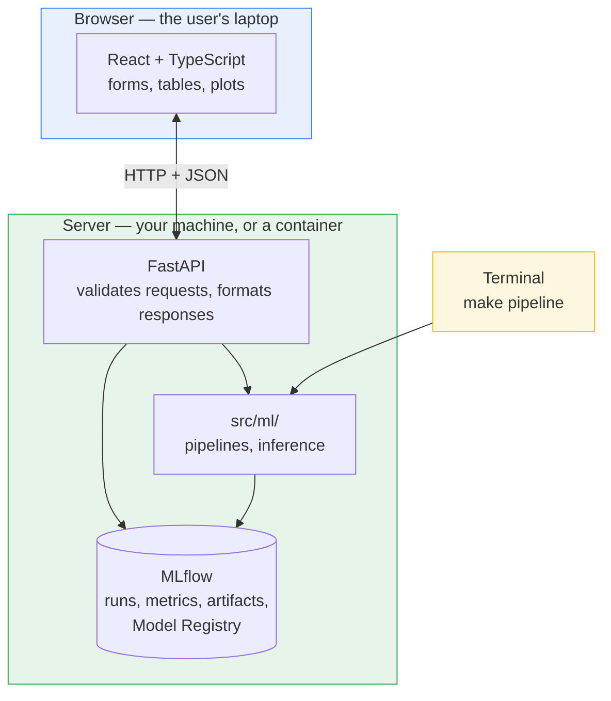

# Architecture

## Who this is for

A data scientist comfortable with Python, pandas, scikit-learn, and MLflow, who
has not built a web application before.

This document explains **how the pieces fit together and why**. It does not
explain how to configure or change any one of them — each part has its own
guide:

| Guide | Covers |
| --- | --- |
| [`ml.md`](ml.md) | Task types, model configuration, schemas, metrics |
| [`backend.md`](backend.md) | The API: endpoints, contracts, layering |
| [`frontend.md`](frontend.md) | React, components, formatting, theming |
| [`handoff.md`](handoff.md) | Where the data comes from when a warehouse feeds this project |

The repository is **one codebase with two front doors**: the terminal, which is
how you have always run this project, and the browser, which is how a
non-technical colleague will use it. Both lead to the same pipelines and the
same trained model. Neither replaces the other.

---

## 1. The core shift: a script versus a server

This is the single most important idea here. Everything else follows from it.

**What you have always had is a script.** You type a command, it runs top to
bottom, writes files, and exits. The Python process lives for a few seconds. If
it hits bad data it raises, prints a traceback, and dies — which is exactly
right, because you are standing there reading the output.

```text
start ──> read CSV ──> transform ──> train ──> log to MLflow ──> exit
```

**A web application needs a server.** It starts once and then does nothing. It
waits. When a request arrives it runs a small piece of Python, sends an answer,
and goes back to waiting. It might do that a thousand times before you stop it.

```text
start ──> load model into memory ──> ┌─> wait ──> answer ──┐
                                     └─────────────────────┘
                                          (forever)
```

Three consequences worth internalising:

**State persists between requests.** A training run loads a model, uses it, and
throws it away at exit. A server loads the model *once at startup* and keeps it
in memory. Loading an MLflow model takes a second or two — unacceptable per
request, irrelevant once.

**A crash is no longer a local event.** When your script raises, you see it and
rerun. When a server raises unhandled, it can take the site down for everyone.
So a server validates input before touching it and turns every failure into a
deliberate, readable response. "Raise loudly and let the user read the
traceback" is right for a pipeline and wrong for a server.

**Something is always running.** You go from one command that finishes to three
processes that stay up.

---

## 2. What "frontend" and "backend" actually mean

**Backend** — Python running on a server. It reads the filesystem, imports
`xgboost`, queries MLflow, loads a model. Nobody sees it directly; it produces
data. This is everything in `backend/`, and it is where all your existing work
lives.

**Frontend** — TypeScript running *inside the user's browser*. It draws forms,
tables, and images. It cannot read your files, import Python libraries, or load
an MLflow model. It can only ask the backend for data and display the answer.

That last point is why the API has to exist. It is a hard constraint, not a
preference:

> A browser cannot run Python. There is no way for a web page to call your model
> directly. Something must sit in between that speaks both languages.

---

## 3. The layers



- **Yellow** is the door you already use. `make pipeline` calls straight into
  `src/ml/` and writes to MLflow. The API is not involved.
- **Green** is the backend. `src/ml/` is your modelling code. FastAPI is a thin
  layer that exposes it over the network.
- **Blue** is the browser, which only ever talks to FastAPI.

Both doors converge on the same `src/ml/` and the same MLflow. **There is no
second copy of the modelling logic.**

---

## 4. Where the model actually lives

The most surprising part for most people: **the API does not contain a model,
and never trains one.** MLflow is the handoff point.

```text
make pipeline  ──writes──>  MLflow Model Registry  <──reads──  FastAPI
   (training)                 models:/<name>/N                (serving)
```

Training and serving are fully decoupled. They do not run at the same time, do
not share memory, and need not run on the same machine. Training publishes a
model; the API loads whatever the latest published version is.

Two details make this work:

**Loading is flavour-agnostic.** The API asks MLflow for "the model" and gets
back something with a `.predict()` method. It has no idea whether you trained
XGBoost, a random forest, or a linear regression. Swapping estimators in
`cfg/config.yaml` requires no API change at all.

**The model carries its own signature.** Training logs a description of the
features it expects — names and types — which the API reads back and republishes.
That is what the next section is built on.

---

## 5. How a prediction travels

A colleague opens the page, fills in a form, and clicks **Predict**.

**1. The browser packages the input** as JSON — a text format structurally
identical to a Python dict:

```json
{ "MEAN_RADIUS": 17.99, "MEAN_TEXTURE": 10.38 }
```

**2. It sends an HTTP request** — a *method* (what kind of action), a *path*
(which resource), and a *body*:

```http
POST /api/predict
Content-Type: application/json

{ "MEAN_RADIUS": 17.99, ... }
```

`POST` means "here is data, do something"; `GET` means "give me something, I am
not changing anything". Those two cover nearly everything here.

**3. FastAPI validates it** before any of your code runs. Missing fields, wrong
types, or text where a number belongs are rejected with a clear message.

**4. Your Python runs.** The request becomes a one-row DataFrame and goes to the
model loaded at startup — ordinary code of the kind you already write.

**5. The answer returns as JSON**, with a status code saying how it went:

```http
200 OK

{ "prediction": 0, "probabilities": {"0": 0.97, "1": 0.03} }
```

**6. React displays it**, without reloading the page.

The round trip is tens of milliseconds, because the expensive part — loading the
model — already happened at startup.

---

## 6. The three rules that keep this a template

Everything unusual about this codebase follows from one goal: it must work for
*your* data, not just the demo. Three rules enforce that.

### Rule 1 — nothing names a feature except your data

If the API declared thirty breast-cancer features and the form rendered thirty
fixed boxes, swapping datasets would break both. Instead:

```text
your CSV ──> training ──> model signature ──> /api/predict/schema ──> the form
```

The frontend *asks* what the fields are and builds itself at runtime. Retrain on
different data, reload the page, and the form has changed.

The same applies to metrics: the dashboard renders whatever MLflow reports
rather than a fixed list, so a regression pipeline logging RMSE displays with no
code change.

### Rule 2 — the contract is generated, never hand-written

The frontend's TypeScript types are generated from the API's own OpenAPI
description (`make types`). Rename a field in Python and the frontend **fails to
compile at the exact line that needs updating**, rather than silently rendering
`undefined`.

### Rule 3 — `api/` translates, `ml/` decides

Nothing in `backend/src/ml/` imports from `backend/src/api/`. Prediction rules,
validation, and MLflow access live in `ml/`; the API only maps their results and
exceptions onto HTTP status codes.

That one property is why the pipelines can be tested without a web server, the
API without MLflow, and the CLI regardless of either.

---

## 7. Vocabulary, translated

| Web term | Means | Closest thing you know |
| --- | --- | --- |
| **Endpoint** / **route** | One URL the server answers | A function in a module |
| **HTTP method** | `GET` = read, `POST` = send | Read versus write |
| **JSON** | Text format for structured data | A `dict`, serialised |
| **Request / response** | Question and answer | Arguments and return value |
| **Status code** | Three digits describing the outcome | Exception type vs successful return |
| **Pydantic** | Declares and validates JSON shapes | Pandera, but for requests |
| **OpenAPI schema** | Machine-readable description of an API | A type stub for a service |
| **Port** | Numbered channel a process listens on | Which door of the building |
| **CORS** | Browser rule on which sites may call an API | An allow-list |
| **Component** | A function returning a piece of page | A function returning a plot axis |
| **State** | Data a component owns; changing it redraws | A variable that triggers a re-plot |
| **Hook** | A `use…` function adding behaviour | A decorator or context manager |
| **SPA** | JS redraws in place instead of reloading | A notebook updating a cell's output |

### Pydantic and Pandera are the same idea

You already validate DataFrames declaratively:

```python
# Pandera — validates a DataFrame
DataFrameSchema({"MEAN_RADIUS": Column(float, Check.ge(0))})
```

Pydantic does the same for HTTP payloads, and FastAPI enforces it automatically:

```python
# Pydantic — validates a JSON request or response
class PredictResponse(BaseModel):
    prediction: int
    probabilities: dict[str, float] | None
```

You write no validation code in either case. Declare the shape; get enforcement
and error messages for free.

---

## 8. Reading the system when something breaks

With several processes running, the useful first question is *which layer
failed*. **Test from the inside out**: MLflow UI, then the API's `/docs`, then
the page. Whichever is the innermost broken layer is where the problem is.

| Symptom | Layer | Check |
| --- | --- | --- |
| Page loads, every panel empty | API not running | Open `http://localhost:8000/docs` |
| Predictions return `503` | No trained model | `make pipeline` |
| Predictions return `422` | Input does not match the signature | Compare against `/api/predict/schema` |
| API fails at startup | MLflow unreachable | Is it running? Is `MLFLOW_TRACKING_URI` right? |
| `/docs` works, page does not | Frontend or CORS | Browser console, Network tab |
| Dashboard empty, predictions fine | No runs logged | Open the MLflow UI directly |
| Header says "API unreachable" | API down or proxy misconfigured | `curl http://localhost:5173/api/health` |
| Wrong metrics for your problem | Task inferred incorrectly | See [`ml.md`](ml.md) |

The status pill in the page header is the quick version: it reports API
reachability and the loaded model version on every screen, so an empty panel is
never ambiguous.

---

## 9. What does not change

- **`make pipeline` works exactly as before.** The CLI is untouched by any of
  the web machinery.
- **`cfg/config.yaml` is still the only place** you configure data and models.
- **You are not obliged to use the API.** This remains a perfectly good batch
  project if you never start the server.

The web layer is strictly additive: a second door into the same house, not a
renovation of the rooms.
